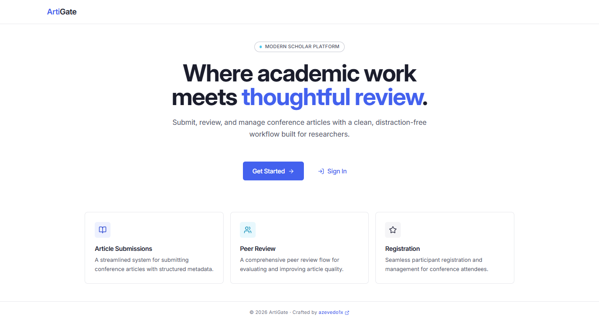
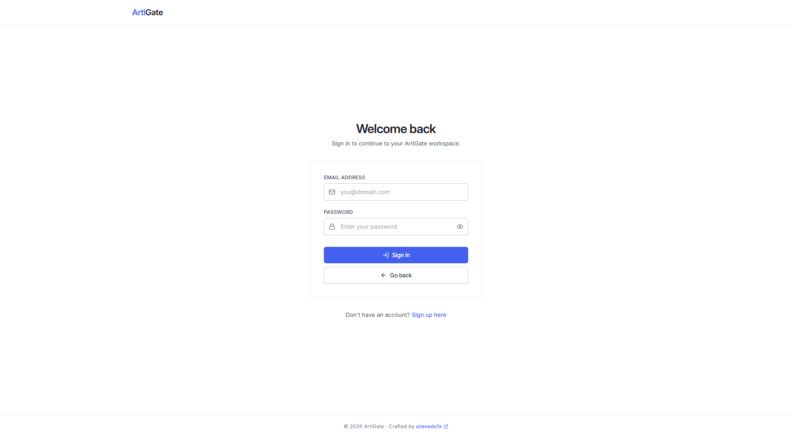
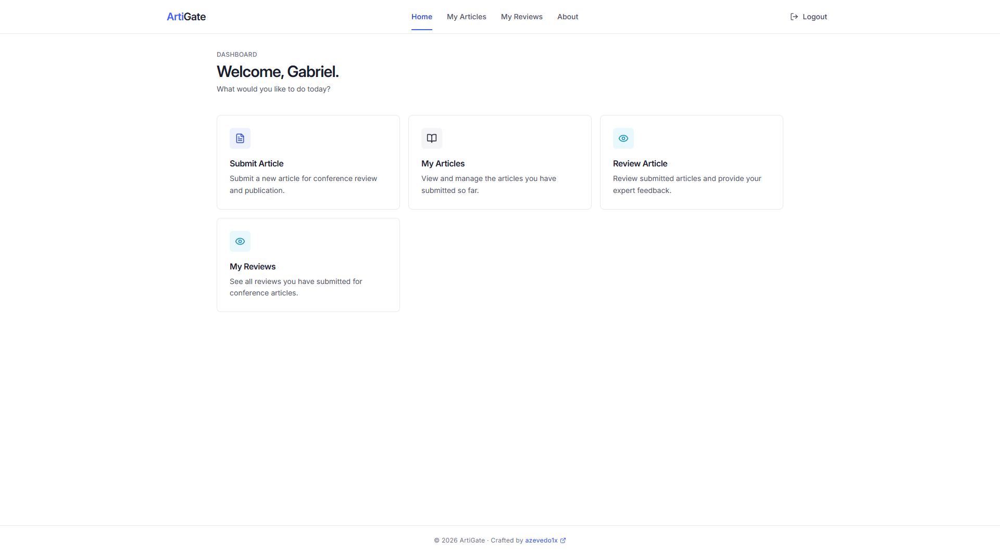
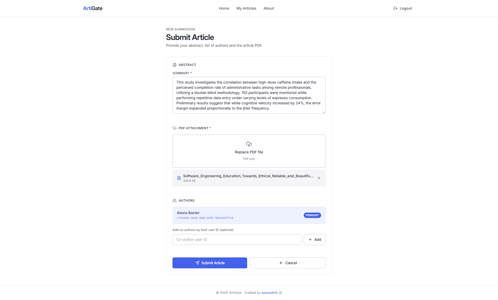
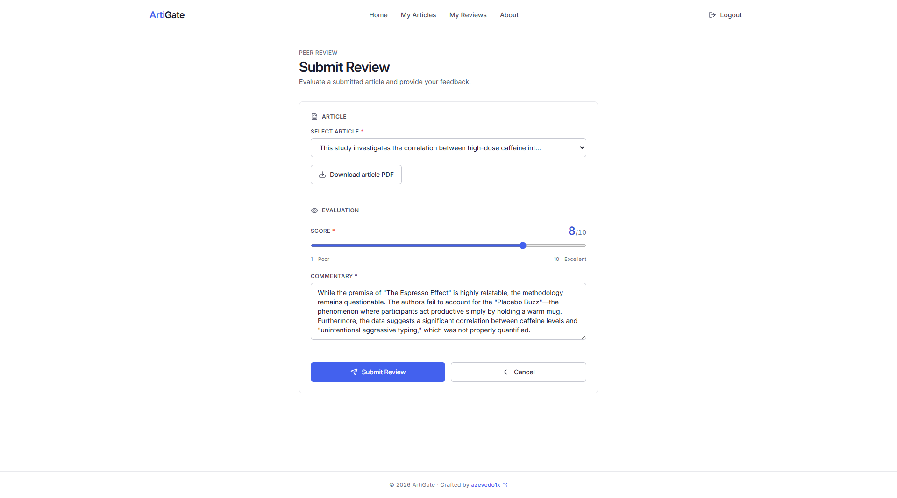
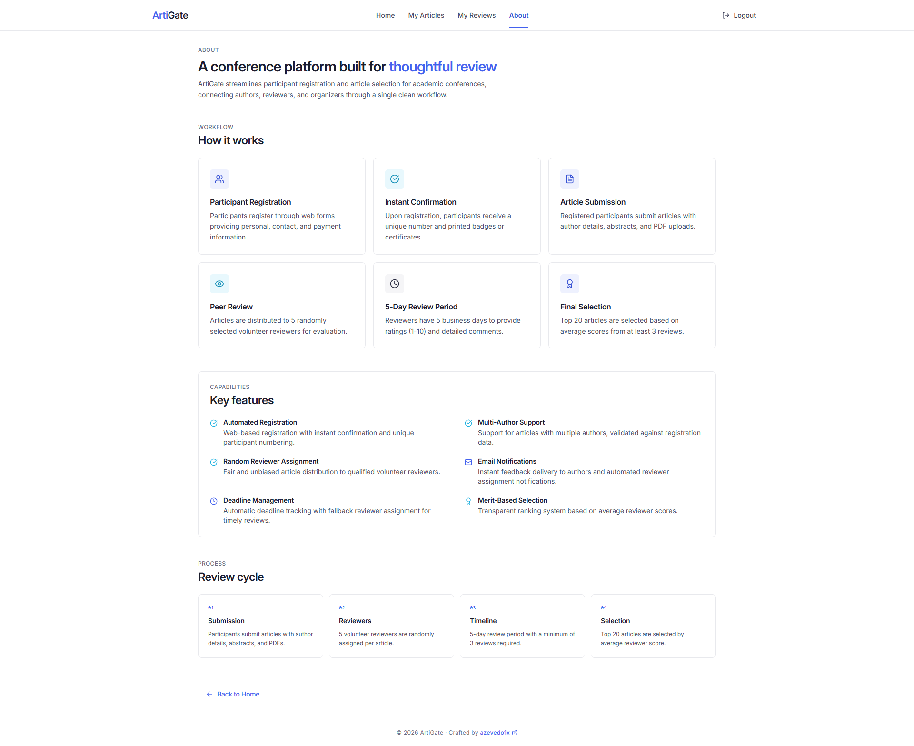

# ArtiGate

ArtiGate is a web application designed to streamline the process of managing academic conferences. It allows participants to register, log in, submit articles, and perform peer reviews, all in one place.

## Motivation

ArtiGate was born out of a professor's frustration with the lack of a centralized, efficient system to handle participant registration, article submission, and peer review. This project addresses that gap, aiming to simplify conference workflows for academics and researchers.

## Tech Stack

* **Frontend**: React 18, Redux Toolkit, React Router, Tailwind CSS, Vite
* **Backend**: NestJS (Clean Architecture)
* **Database**: SQLServer (via Prisma ORM)
* **Monorepo**: Nx

## Features

* **User registration and authentication** (JWT-based)
* **Article submission** with summary, author association, and mandatory PDF attachment
* **PDF attachments**: secure upload (magic-byte + structure validation), SHA-256 checksum, hardened download (sandboxed CSP, `nosniff`, `no-store`), and per-route rate limiting
* **Peer review system** with score (1-10) and commentary
* **Automatic score averaging** on article after each review
* **Business rules**: prevents self-review and duplicate reviews per reviewer
* **Soft-delete** across all entities
* **Role-based access**: reviewer-only pages and actions
* **My Articles** page with expandable review details per article and PDF download
* **My Reviews** page for reviewers to track submitted reviews
* **Payment gateway**: Mercado Pago integration for the access fee; client-side card tokenization (PAN/CVV never reach the backend), idempotent charges, signed webhooks (HMAC-SHA256, constant-time compare), monotonic status transitions, and PII-stripped gateway payloads. Article submission and reviewing are gated by `AccessFeePaymentGuard` until the fee is approved. A mock mode (`ENABLE_PAYMENT_MOCK=true`) bypasses the gateway for local dev and tests.

## Project Structure

```
/backend-api              # NestJS backend API
  └── src/app/
      ├── application/       # Use cases: services + DTOs
      ├── config/            # App configuration
      ├── domain/            # Business entities and repository interfaces
      ├── infrastructure/    # Prisma repositories
      ├── interface/         # Controllers and abstract adapters
      ├── modules/           # NestJS feature modules
      └── shared/            # Filters, pipes, guards, utilities

/frontend                 # React frontend
  └── src/
      ├── app/               # Root app component and routing
      ├── components/        # Reusable UI components
      ├── config/            # Frontend configuration
      ├── pages/             # Route-level page components
      ├── services/          # API client services
      ├── store/slices/      # Redux state (user, roles)
      ├── providers/         # Context providers (toast)
      ├── shared/types/      # Shared TypeScript types
      └── utils/             # Utility functions

/prisma                   # Database schema and migrations
```

## Pages and Routes

| Route | Page | Access |
|---|---|---|
| `/` | Landing | Public |
| `/login` | Login | Public |
| `/signup` | Sign Up | Public |
| `/about` | About | Public |
| `/home` | Home (dashboard) | Authenticated |
| `/checkout` | Checkout (access fee) | Authenticated |
| `/submit-article` | Submit Article | Authenticated + Access fee paid |
| `/my-articles` | My Articles | Authenticated |
| `/submit-review` | Submit Review | Authenticated + Reviewer + Access fee paid |
| `/my-reviews` | My Reviews | Authenticated + Reviewer |

## API Modules

| Module | Endpoints |
|---|---|
| User | CRUD, find by email/address/review |
| Role | CRUD, find by name |
| Address | CRUD |
| Article | CRUD, find by author, upload/download PDF attachment |
| Review | CRUD, find by reviewer, find by article |
| Payment | Create charge, list mine, get by id, access-fee status, gateway webhook |

## Screenshots

### Landing Page


### Login


### Dashboard


### Submit Article


### Submit Review


### About


## Getting Started

### Prerequisites

* Node.js (v18+)
* npm
* SQL Server

### Installation

```bash
npm install
```

Copy `.env.example` to `.env` and configure your database connection, JWT secret, PDF upload settings (`UPLOAD_DIR`, `MAX_PDF_BYTES`), and Mercado Pago credentials (`MERCADO_PAGO_ACCESS_TOKEN`, `MERCADO_PAGO_PUBLIC_KEY`, `MERCADO_PAGO_WEBHOOK_SECRET`, `MERCADO_PAGO_NOTIFICATION_URL`). For local dev without real credentials, set `ENABLE_PAYMENT_MOCK=true` to enable the mock gateway. The frontend reads `VITE_MERCADO_PAGO_PUBLIC_KEY` and `VITE_ENABLE_PAYMENT_MOCK` from its own `.env`.

### Running

```bash
# Frontend (http://localhost:3001)
npx nx serve frontend

# Backend (http://localhost:3000)
npx nx serve backend-api
```

### Testing and Linting

```bash
npx nx test backend-api     # Unit tests
npx nx test backend-api-e2e # E2E tests
npx nx lint                  # Lint all projects
```

## Database

Migrations are managed via Prisma. Models: User, Role, UserRole, Address, Article, ArticleAuthor, ArticleAttachment, Review, Payment.

```bash
npx prisma migrate dev    # Apply migrations
npx prisma studio         # Visual database browser
```

## Contributing

Want to help? Feel free to open an issue or submit a pull request.

## License

MIT

## About the Author

Created by [Gabriel Azevedo](https://github.com/azevedo1x/)
Contact: see email in GitHub bio
