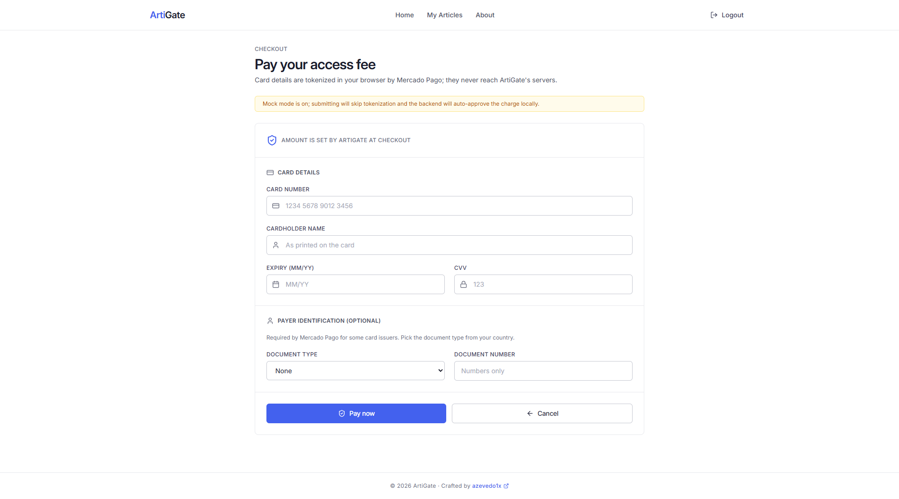

<h1 align="center">ArtiGate</h1>

<p align="center">
  
  
  
  
  
  
</p>

---

## See it in action

A researcher shows up for the conference:

```
sign up  →  pay the access fee  →  submit the paper
```

Behind the **pay** step, the card gets tokenized **in the browser**. The PAN and CVV never touch the backend; ArtiGate only ever sees a token. The charge is idempotent, so a double-click doesn't become a double-charge.

Then they submit:

```
title + summary + authors + a PDF
```

The PDF doesn't get trusted on its file extension. ArtiGate reads the **magic bytes**, validates the structure, computes a **SHA-256 checksum**, and serves it back later behind a sandboxed CSP with `nosniff` and `no-store`. A `.pdf` that's secretly something else doesn't make it in.

A reviewer opens it, scores it `1–10`, leaves a comment:

> **Reviewer** · score: 8
> Solid methodology, but the related-work section needs another pass.

The article's average score updates the moment the review lands. The reviewer can't score their own paper, and can't review the same one twice. The rules enforce themselves.

## Why this exists

ArtiGate was born out of a professor's frustration with the lack of a centralized, efficient system to handle participant registration, article submission, and peer review.

Conferences run on scattered spreadsheets, lost email attachments, and "did you get my paper?" follow-ups. Somebody has to be the gatekeeper; checking who paid, who submitted, who's allowed to review what. That somebody is now a NestJS process that doesn't forget and doesn't play favorites.

## The gate has rules

ArtiGate is opinionated about who can do what. Two gates stand between a user and the good parts:

| Gate | What it blocks | Enforced by |
|---|---|---|
| **Auth** | Everything past the public pages | JWT bearer + `AuthGuardService` |
| **Access fee** | Submitting articles & reviewing | `AccessFeePaymentGuard` (needs an approved payment) |
| **Role** | Reviewer-only pages and actions | `RoleProtectedRoute` + `GetUserRoleService` |

Plus the quieter business rules baked into the domain: no self-reviews, no duplicate reviews per reviewer, automatic score averaging, and **soft-delete** everywhere; nothing is ever truly gone, just filtered out.

> **Gotcha:** signing up isn't enough to submit or review. The access fee has to be **approved** first. Running locally without real Mercado Pago credentials? Set `ENABLE_PAYMENT_MOCK=true` and the mock gateway approves you without a real card.

## What it does

- **Auth**; JWT-based registration and sign-in, with bcrypt-hashed passwords.
- **Article submission**; title, summary, author association, and a mandatory PDF.
- **Hardened PDF attachments**; magic-byte + structure validation on upload, SHA-256 checksum, sandboxed download (CSP, `nosniff`, `no-store`), and per-route rate limiting.
- **Peer review**; score `1–10` plus commentary, with self-review and duplicate-review prevention.
- **Live score averaging**; the article's average recomputes after every review.
- **Role-based access**; reviewer-only pages and actions.
- **My Articles**; expandable review details per article, with PDF download.
- **My Reviews**; reviewers track everything they've submitted.
- **Payments**; Mercado Pago access fee with client-side tokenization, idempotent charges, **HMAC-SHA256 signed webhooks** (constant-time compare), monotonic status transitions (no `approved → pending` regressions), and PII-stripped gateway payloads. Mock mode for local dev.

## Get it running

**1. Prerequisites.** Node.js 18+, npm, and a SQL Server instance.

**2. Install.**
```bash
git clone https://github.com/azevedo1x/ArtiGate.git
cd ArtiGate
npm install
```

**3. Configure.** Copy `.env.example` to `.env` and fill in your `DATABASE_URL`, `JWT_SECRET` (≥32 chars), PDF settings (`UPLOAD_DIR`, `MAX_PDF_BYTES`), and Mercado Pago credentials (`MERCADO_PAGO_ACCESS_TOKEN`, `MERCADO_PAGO_PUBLIC_KEY`, `MERCADO_PAGO_WEBHOOK_SECRET`, `MERCADO_PAGO_NOTIFICATION_URL`). The frontend reads `VITE_MERCADO_PAGO_PUBLIC_KEY` and `VITE_ENABLE_PAYMENT_MOCK` from its own `.env`.

> No payment credentials yet? `ENABLE_PAYMENT_MOCK=true` lets the whole app boot and run without a real gateway.

**4. Set up the database.**
```bash
npx prisma migrate dev    # apply migrations
npx prisma db seed        # optional: seed starter data
```

**5. Run it.**
```bash
npx nx serve frontend     # http://localhost:3001  (Vite)
npx nx serve backend-api  # http://localhost:3000  (NestJS, Swagger at /)
```

## What it's made of

An Nx monorepo, two apps, dependencies flowing inward. The backend follows **Clean Architecture**; layers depend inward only, ports on every boundary.

| Project | Does what |
|---|---|
| `frontend` | Vite + React 18 + Redux Toolkit. Lazy-routed pages, an Axios client that attaches the JWT, and a Redux store that's the source of truth for the current user + roles. |
| `backend-api` | NestJS, Clean Architecture. `domain` (pure entities) → `application` (one service per use case) → `interface` (controller + repository/gateway ports) → `infrastructure` (Prisma + external adapters). |
| `prisma` | SQL Server schema, migrations, and seed. UUID keys, soft-delete, audit timestamps everywhere. |

| Piece | Why it's here |
|---|---|
| `NestJS 11` | Backend framework; controllers stay thin, services do the work |
| `Prisma 6 + SQL Server` | Typed data access; repositories implement domain-facing ports |
| `React 18 + Redux Toolkit` | Frontend SPA and single source of truth for auth state |
| `Tailwind CSS` | Styling without leaving the markup |
| `mercadopago 2.x` | Payment gateway adapter, swappable for a mock |
| `class-validator` + global `ValidationPipe` | DTOs that reject anything they didn't ask for (`whitelist` + `forbidNonWhitelisted`) |
| `Joi` | Validates env vars at boot; a missing secret aborts the launch, not a request at 2 a.m. |

## Pages and routes

| Route | Page | Who gets in |
|---|---|---|
| `/` | Landing | Public |
| `/login` | Login | Public |
| `/signup` | Sign Up | Public |
| `/about` | About | Public |
| `/home` | Dashboard | Authenticated |
| `/checkout` | Checkout (access fee) | Authenticated |
| `/submit-article` | Submit Article | Authenticated + fee paid |
| `/my-articles` | My Articles | Authenticated |
| `/submit-review` | Submit Review | Authenticated + Reviewer + fee paid |
| `/my-reviews` | My Reviews | Authenticated + Reviewer |

## API modules

| Module | Endpoints |
|---|---|
| User | CRUD, find by email/address |
| Role | CRUD, find by name |
| Address | CRUD |
| Article | CRUD, find by author, upload/download PDF attachment |
| Review | CRUD, find by reviewer, find by article |
| Payment | Create charge, list mine, get by id, access-fee status, gateway webhook |

## Screenshots

| | |
|---|---|
| **Landing**  | **Login**  |
| **Checkout**  | **Dashboard**  |
| **Submit Article**  | **Submit Review**  |
| **About**  | |

## Tests and linting

```bash
npx nx test backend-api      # backend unit tests (Jest)
npx nx test backend-api-e2e  # e2e tests
npx nx test frontend         # frontend tests (Jest + jsdom)
npx nx lint                  # lint every project
npx nx run-many -t typecheck # typecheck every project
```

Nx caches `build`, `lint`, `test`, and `typecheck`. If the cache ever lies to you, `npx nx reset`.

## Contributing

Found a bug? Want a gate that opens differently? Open an issue or send a pull request.

## License

MIT.

---

<p align="center">
  <sub>Built for the professor who was tired of chasing PDFs through email.</sub>
  <br/>
  <sub>Made with NestJS, React, and a firm belief that every paper deserves a fair gate.</sub>
  <br/><br/>
  <sub>by <a href="https://github.com/azevedo1x/">Gabriel Azevedo</a></sub>
</p>
